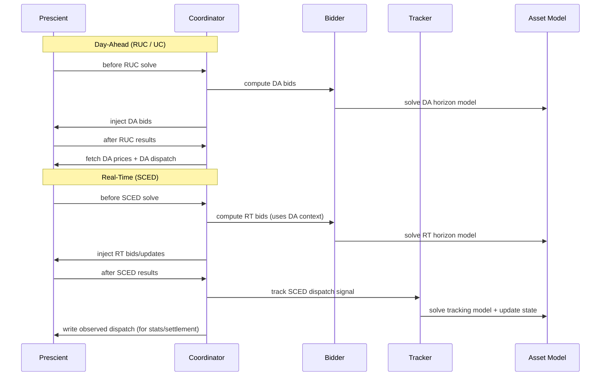

---
{"dg-publish":true,"permalink":"/30-projects/double-simulation-loop/ppt-contents/"}
---

---

# What IDAES is?

IDAES provides the optimization-side “brain” for our asset model and bidding logic. In this repo, that is the `grid_integration` package: bidder logic in [bidder.py](https://www.google.com/search?q=/Users/vardhans/Projects/idaes-pse/idaes/apps/grid_integration/bidder.py), tracking logic in [tracker.py](https://www.google.com/search?q=/Users/vardhans/Projects/idaes-pse/idaes/apps/grid_integration/tracker.py), orchestration in [coordinator.py](https://www.google.com/search?q=/Users/vardhans/Projects/idaes-pse/idaes/apps/grid_integration/coordinator.py), forecast interfaces in [forecaster.py](https://www.google.com/search?q=/Users/vardhans/Projects/idaes-pse/idaes/apps/grid_integration/forecaster.py), and generator metadata structures in [model_data.py](https://www.google.com/search?q=/Users/vardhans/Projects/idaes-pse/idaes/apps/grid_integration/model_data.py). Our asset model (thermal, IDC, etc.) is the plant-side Pyomo model object that exposes the expected API (`populate_model`, `update_model`, `power_output`, `total_cost`, etc.), like [thermal_generator.py](https://www.google.com/search?q=/Users/vardhans/Projects/idaes-pse/idaes/apps/grid_integration/examples/thermal_generator.py).

The double-loop works as a repeated market-control cycle. First, the plugin module (for example [thermal_generator_prescient_plugin.py](https://www.google.com/search?q=/Users/vardhans/Projects/idaes-pse/idaes/apps/grid_integration/examples/thermal_generator_prescient_plugin.py)) builds three model objects: one for bidding, one for real-time tracking, and one projection tracker(They are separate because these roles can diverge in time and state. If you reused one single object, bidding updates, tracking updates, and forward projection would overwrite each other and corrupt the rolling-horizon logic.). Then it creates `Bidder`, `Tracker`, and `DoubleLoopCoordinator`, and exposes `get_configuration` and `register_plugins` so Prescient can call into IDAES.

At each day-ahead cycle, coordinator asks bidder to solve a stochastic multiperiod bidding problem over a horizon (typically 48 hours). Bidder clones the model across scenarios/hours, applies price forecasts, solves, and converts optimal trajectories into market bids. Coordinator injects those bids into Prescient’s market model before DA clearing.

After DA clears, coordinator pulls cleared DA dispatch and DA prices from Prescient and stores them. In real time, coordinator repeatedly forms a tracking signal (current SCED dispatch + future DA trajectory), sends that to tracker, and tracker solves a shorter-horizon optimization to follow market instructions while respecting plant physics. Tracker returns implemented profiles; coordinator pushes those back to update internal model state (e.g., previous output, backlog/state variables), and bidder model is also updated so the next bidding solve starts from the right state.

So the core idea is: IDAES continuously alternates between “plan optimal bids” and “track realized dispatch with plant physics,” with coordinator keeping bidder, tracker, and market data synchronized across time.

# What Prescient is?

**What Prescient is doing here**

- Reads RTS-GMLC-style input data from `data_path` (demand, generators, reserves, etc.).
- Builds and solves DA UC and RT SCED repeatedly over the simulation horizon.
- Publishes market outputs (DA prices, DA cleared quantities, RT dispatch/LMP, ops stats).
- Calls our double-loop plugin hooks before/after key market steps.

We pass Prescient options from the example script here:

- [`/Users/vardhans/Projects/idaes-pse/idaes/apps/grid_integration/examples/thermal_generator.py:776`](https://www.google.com/search?q=/Users/vardhans/Projects/idaes-pse/idaes/apps/grid_integration/examples/thermal_generator.py:776)
- `options["data_path"] = prescient_5bus`
- `Prescient().simulate(**options)` at line 800.

**What parts of Prescient IDAES is actually using**

IDAES coordinator registers into Prescient plugin callbacks here:

- [`/Users/vardhans/Projects/idaes-pse/idaes/apps/grid_integration/coordinator.py:58`](https://www.google.com/search?q=/Users/vardhans/Projects/idaes-pse/idaes/apps/grid_integration/coordinator.py:58)

Main callback flow used:

- Before RUC solve: push DA bids (`bid_into_DAM`)
- After RUC generation: fetch DA prices + DA dispatch (`fetch_DA_prices`, `fetch_DA_dispatches`)
- Before operations solve: push RT bids (`bid_into_RTM`)
- After operations: run tracker on SCED signal (`track_sced_signal`)
- Update ops stats: report observed dispatch (`update_observed_dispatch`)

**Clean workflow (start to end)**

1. Prescient initializes simulation with the dataset and options.
2. Prescient calls IDAES plugin init callbacks.
3. For each DA cycle:
    
    - IDAES bidder computes bids.
    - Prescient RUC clears market.
    - IDAES reads DA prices/dispatch from Prescient results.
    
4. For each RT step
    
    - IDAES sends RT bid updates.
    - Prescient SCED clears.
    - IDAES tracker follows SCED dispatch and updates internal plant state.
    - IDAES writes implemented dispatch back to Prescient ops stats.
    
5. Prescient records reports/settlements and moves to next step.
6. Finalization callback writes plugin-side results.

**How Prescient currently treats load**

Prescient data providers populate demand as time series input (system demand), not as a bid participant in our current integration path:

- [`/Users/vardhans/Library/Python/3.11/lib/python/site-packages/prescient/data/data_provider.py:103`](https://www.google.com/search?q=/Users/vardhans/Library/Python/3.11/lib/python/site-packages/prescient/data/data_provider.py:103)

So load is present and essential, but it is exogenous (non-price-responsive in this pipeline).

**Where the Egret-engine limitation appears for our use case**

The DA market object and settlement paths used here are generator-category based:

- DA cleared containers built only for `thermal/renewable/virtual` generator types:
    
    - [`/Users/vardhans/Library/Python/3.11/lib/python/site-packages/prescient/engine/egret/egret_plugin.py:572`](https://www.google.com/search?q=/Users/vardhans/Library/Python/3.11/lib/python/site-packages/prescient/engine/egret/egret_plugin.py:572)

- Operations stats/settlement fields also track only those categories:
    
    - [`/Users/vardhans/Library/Python/3.11/lib/python/site-packages/prescient/stats/operations_stats.py:99`](https://www.google.com/search?q=/Users/vardhans/Library/Python/3.11/lib/python/site-packages/prescient/stats/operations_stats.py:99)
    

That is why our IDC-as-true-load idea is blocked today: this path has no native load-bid participant channel exposed to IDAES double-loop.

# What is the problem we are trying to solve

We are solving the integration of an Internet Data Center (IDC) into the IDAES + Prescient double-loop workflow as a **price-taking flexible demand asset**. The IDC should participate in day-ahead and real-time operation by adjusting its internal workload-service decisions based on market prices, while still satisfying physical and service-quality constraints (servers, backlog, cooling, import limits). The goal is to replace a fixed-demand behavior with an optimization-driven controllable demand behavior, without losing operational realism.

At this stage, the market assumption is **price taker**: the IDC does not set market prices and does not strategically influence clearing. It observes DA/RT prices and computes its best-response schedule (how much to consume/serve) at each step. In simple terms, we are trying to make “compute load shifting” economically optimal and physically feasible inside the market simulation loop.

$$\min \sum_t \left(\lambda_t \, P^{grid}_t + c_{drop} \, drop_t + c_{backlog} \, backlog_t \right)$$

$$\text{s.t. backlog dynamics, service capacity, server/power/cooling constraints, and } P^{grid}_t \le P^{max}$$

$$\text{(price-taker setting: } \lambda_t \text{ is input data, not a decision variable).}$$

# What do we need to solve this problem

To achieve the IDC price-taker objective, we need to solve four technical blocks together. First, we need a correct IDC optimization model with state updates across time, so backlog, service, and power are physically consistent in rolling horizon operation. Second, we need interface compatibility with IDAES double-loop components, meaning the IDC model must expose the required methods and outputs that bidder/tracker/coordinator expect.

Third, we need market-integration plumbing that maps IDC decisions to the market signal path (DA/RT prices in, dispatch/implementation out) while preserving sign conventions and participant semantics. Since our end goal is true load-side participation, this also means adding load-participant pathways rather than relying on generator-shaped proxies. Fourth, we need validation infrastructure: reproducible runs, saved outputs, concise summaries, and tests that verify feasibility, SLA behavior, backlog limits, and consistency between bidding and tracking updates.

In short, the work is: build a sound IDC optimizer, connect it cleanly to rolling-horizon control, extend market interfaces for load-side behavior, and validate the full closed loop end-to-end.

# What IDAES provide us and what it doesn't ?

**What IDAES Provides Us That We Can Use**

IDAES gives us a ready double-loop architecture that is very useful even for IDC work: rolling-horizon bidding + real-time tracking + coordinator synchronization are already built and tested. The core modules ([`bidder.py`](https://www.google.com/search?q=/Users/vardhans/Projects/idaes-pse/idaes/apps/grid_integration/bidder.py), [`tracker.py`](https://www.google.com/search?q=/Users/vardhans/Projects/idaes-pse/idaes/apps/grid_integration/tracker.py), [`coordinator.py`](https://www.google.com/search?q=/Users/vardhans/Projects/idaes-pse/idaes/apps/grid_integration/coordinator.py)) provide the control skeleton, plugin wiring, and state-update loop we need.

It also provides a clear model-object API pattern (from thermal example) that we can reuse for any asset optimization model, including IDC. We already leverage this through methods like `populate_model`, `update_model`, `get_implemented_profile`, `power_output`, and `total_cost`. So even before full load-side support, IDAES gives a strong reusable architecture.

**What IDAES Does Not Provide (But We Need)**

IDAES `grid_integration` is currently generator-centric in the market interface path. It does not natively provide a first-class **price-responsive load participant** abstraction with load-bid schema and load-side dispatch bookkeeping in the coordinator/bidder flow. In practice, this means true IDC-as-load participation is missing from default framework behavior.

So what is missing is not optimization capability (Pyomo modeling is fine), but participant semantics and data plumbing for load-side bidding/settlement. That is the gap to close for our target design.

# What Prescient provide us and what it doesn't?

**What Prescient Provides Us That We Can Use**

Prescient provides the actual market simulation engine: DA UC + RT SCED solving, LMP formation, dispatch trajectories, time progression, and reporting/statistics. It also provides plugin callback hooks, which is how IDAES injects bids and reads market outcomes in the double-loop workflow. It handles system demand, network constraints, and market chronology, so we don’t need to build a market simulator ourselves.

**What Prescient Does Not Provide (for our target)**

In the path we are using, Prescient does not expose a native load-bidding participant flow equivalent to the generator flow used by IDAES double-loop. The DA/RT cleared-quantity and settlement paths are organized around thermal/renewable/virtual generators in current Egret-integrated code. So for true IDC as controllable price-responsive load, missing pieces are load-participant bid ingestion, load-cleared DA/RT outputs in the same callback/report pipeline, and settlement bookkeeping for that participant type.

```mermaid
flowchart TB

%% =========================
%% High-level architecture
%% =========================

subgraph P["Prescient (market simulator)"]
  TM["Time Manager / Simulator Loop"]
  RUC["Day-Ahead: RUC (Unit Commitment)"]
  SCED["Real-Time: SCED (Economic Dispatch)"]
  OPS["Ops Stats / Settlement / Reports"]
end

subgraph E["Egret (optimization engine inside Prescient)"]
  E_RUC["Egret UC model build + solve"]
  E_SCED["Egret SCED model build + solve"]
end

subgraph I["IDAES grid_integration (optimization/control layer)"]
  COORD["DoubleLoopCoordinator\n(orchestration + callback handlers)"]
  BIDDER["Bidder\n(DA/RT bid optimization)"]
  TRACKER["Tracker\n(dispatch-following optimization)"]
  PROJ["Projection Tracker\n(trajectory projection for state update)"]
  FC["Forecaster\n(prices / stats interface)"]
end

subgraph A["Asset Model Object (you write this)"]
  MODEL["IDC / Thermal / ASU model\npopulate_model, update_model,\nget_implemented_profile,\npower_output, total_cost"]
end

%% =========================
%% Plugin wiring
%% =========================

PLUGIN["Prescient Plugin Module\n(get_configuration, register_plugins)"]

PLUGIN --> COORD
COORD --> BIDDER
COORD --> TRACKER
COORD --> PROJ
BIDDER --> FC
TRACKER --> MODEL
BIDDER --> MODEL
PROJ --> MODEL

%% =========================
%% Simulation timeline + callbacks
%% =========================

TM -->|initialization callbacks| COORD

TM -->|before RUC solve| COORD
COORD -->|asks| BIDDER
BIDDER -->|compute DA bids| MODEL
COORD -->|inject bids into Prescient data| RUC

RUC --> E_RUC --> RUC
TM -->|after RUC generation| COORD
COORD -->|fetch DA prices/dispatch| RUC
COORD -->|push DA stats| FC

TM -->|before SCED solve| COORD
COORD -->|compute RT bids| BIDDER
BIDDER -->|uses realized DA context + forecasts| FC
COORD -->|inject RT bids/updates| SCED

SCED --> E_SCED --> SCED
TM -->|after operations| COORD
COORD -->|tracking signal| TRACKER
TRACKER -->|track dispatch + update physical states| MODEL
COORD -->|update bidder + tracker states| BIDDER

TM -->|update ops stats| COORD
COORD -->|push observed dispatch| OPS

TM -->|finalization callback| COORD
COORD -->|write results| BIDDER
COORD -->|write results| TRACKER

%% =========================
%% Where "generator-centric" limitation sits
%% =========================

subgraph G["Current IDAES↔Prescient integration seam"]
  GENPATH["Bids/dispatch/plans wired through\nPrescient 'generator' elements:\nthermal / renewable / virtual"]
end

COORD -.-> GENPATH
GENPATH -.-> RUC
GENPATH -.-> SCED

%% =========================
%% Desired load-side path (future work)
%% =========================

subgraph L["Desired load-side participant seam (future)"]
  LOADPATH["Price-responsive load bidding + clearing\nwired through Prescient 'load' elements\n(+ settlement/reporting support)"]
end

COORD -. future extension .-> LOADPATH
LOADPATH -. future extension .-> RUC
LOADPATH -. future extension .-> SCED
```

**What we have to build**

| Area                         | Build Item                                       | Purpose                                                                                                                          | Reuse Existing?                               | Minimum Change Path                                |
| ---------------------------- | ------------------------------------------------ | -------------------------------------------------------------------------------------------------------------------------------- | --------------------------------------------- | -------------------------------------------------- |
| IDAES                        | `load.py` (or `idc_load.py`)                     | Asset/load model API (`populate_model`, `update_model`, implemented profile, cost, market-facing variable) for controllable load | Reuse thermal/idc model-object pattern        | New file in `examples/` first, then promote        |
| IDAES                        | `load_prescient_plugin.py`                       | Wires load model + bidder + tracker + coordinator into Prescient callbacks                                                       | Reuse plugin skeleton from thermal/idc plugin | New plugin module                                  |
| IDAES                        | `bidder_load.py` or extend `bidder.py`           | Build load bid structure (demand-side bids), sign conventions, constraints for load monotonicity                                 | Partially reuse stochastic framework          | Prefer subclass/extension, not full rewrite        |
| IDAES                        | `tracker_load.py` or extend `tracker.py`         | Track awarded load consumption trajectory and state updates                                                                      | Reuse most tracker MPC logic                  | Add load semantics flags + mappings                |
| IDAES                        | `coordinator_load.py` or extend `coordinator.py` | Route bids/dispatch to load element in Prescient (`elements["load"]` path) and pull DA/RT load clears                            | Reuse callback structure                      | Extend coordinator with participant-type branching |
| IDAES                        | `model_data.py` extension                        | Add load participant metadata class (name, bus, bounds, bid fields)                                                              | Reuse validators/iterable pattern             | Add `LoadModelData`                                |
| Prescient (Egret path)       | Market result containers                         | Add DA/RT cleared quantities for load participants in `RucMarket`/ops stats                                                      | Limited reuse                                 | Extend dictionaries/fields analogous to gen paths  |
| Prescient (Egret path)       | Bid ingestion for load                           | Accept and apply load bid updates in UC/SCED model data pipeline                                                                 | Partial reuse of bid update plumbing          | Add load bid update hooks                          |
| Prescient (stats/settlement) | Settlement logic for load                        | Compute payments/uplift for responsive load participant                                                                          | Reuse revenue framework concept               | Add load-side settlement terms                     |
| Prescient (reporting)        | CSV/report outputs                               | Expose load bids, cleared quantities, revenues/payments                                                                          | Reuse reporting manager structure             | Add load report tables                             |

If you want a strict “MVP” row set for the slide, use only these 5 rows: `load model`, `load plugin`, `bidder extension`, `coordinator extension`, `Prescient market+settlement extension`.

**Scope**
This report is based on the Prescient/Egret code installed in your environment and the IDAES `grid_integration` integration path you are using.

**A) Evidence that Prescient already supports generator-side market participation**

| Capability | Evidence in code | Why this proves generator schema is first-class |
|---|---|---|
| DA market object explicitly stores generator-cleared quantities by type | [`data_manager.py:22`](/Users/vardhans/Library/Python/3.11/lib/python/site-packages/prescient/simulator/data_manager.py:22) to [`data_manager.py:30`](/Users/vardhans/Library/Python/3.11/lib/python/site-packages/prescient/simulator/data_manager.py:30) | `RucMarket` has `thermal_gen_cleared_DA`, `renewable_gen_cleared_DA`, `virtual_gen_cleared_DA`; no analogous load-cleared field |
| DA cleared quantities are constructed by iterating generator elements and `generator_type` | [`egret_plugin.py:576`](/Users/vardhans/Library/Python/3.11/lib/python/site-packages/prescient/engine/egret/egret_plugin.py:576) to [`egret_plugin.py:596`](/Users/vardhans/Library/Python/3.11/lib/python/site-packages/prescient/engine/egret/egret_plugin.py:596) | Core DA extraction path is keyed to `elements('generator')` and type dispatch (`thermal/renewable/virtual`) |
| Operations stats schema is generator-category based for DA clears/revenue/uplift | [`operations_stats.py:99`](/Users/vardhans/Library/Python/3.11/lib/python/site-packages/prescient/stats/operations_stats.py:99) to [`operations_stats.py:113`](/Users/vardhans/Library/Python/3.11/lib/python/site-packages/prescient/stats/operations_stats.py:113) | Dedicated fields exist for thermal/renewable/virtual generator settlements |
| Settlement calculations are done for generator categories | [`operations_stats.py:282`](/Users/vardhans/Library/Python/3.11/lib/python/site-packages/prescient/stats/operations_stats.py:282) to [`operations_stats.py:314`](/Users/vardhans/Library/Python/3.11/lib/python/site-packages/prescient/stats/operations_stats.py:314) | DA/RT payment math loops over thermal/renewable/virtual generator sets |
| Reports are organized into thermal/renewables/virtual generator detail CSVs | [`reporting_manager.py:100`](/Users/vardhans/Library/Python/3.11/lib/python/site-packages/prescient/simulator/reporting_manager.py:100) to [`reporting_manager.py:167`](/Users/vardhans/Library/Python/3.11/lib/python/site-packages/prescient/simulator/reporting_manager.py:167) | Dedicated reporting pipelines exist for generator participant categories |
| IDAES plugin integration writes bids into `elements["generator"]` | [`coordinator.py:290`](/Users/vardhans/Projects/idaes-pse/idaes/apps/grid_integration/coordinator.py:290), [`coordinator.py:610`](/Users/vardhans/Projects/idaes-pse/idaes/apps/grid_integration/coordinator.py:610) | Your integration path is explicitly generator-parameter injection |
| IDAES fetches DA dispatch only from generator-cleared dicts | [`coordinator.py:569`](/Users/vardhans/Projects/idaes-pse/idaes/apps/grid_integration/coordinator.py:569) to [`coordinator.py:573`](/Users/vardhans/Projects/idaes-pse/idaes/apps/grid_integration/coordinator.py:573) | No load-cleared path exists in current coordinator logic |

**B) Evidence that load is treated as exogenous (in this workflow)**

| Capability | Evidence in code | Why this indicates exogenous load treatment |
|---|---|---|
| Data provider contracts populate demand as input data | [`data_provider.py:103`](/Users/vardhans/Library/Python/3.11/lib/python/site-packages/prescient/data/data_provider.py:103) to [`data_provider.py:107`](/Users/vardhans/Library/Python/3.11/lib/python/site-packages/prescient/data/data_provider.py:107), [`data_provider.py:143`](/Users/vardhans/Library/Python/3.11/lib/python/site-packages/prescient/data/data_provider.py:143) to [`data_provider.py:147`](/Users/vardhans/Library/Python/3.11/lib/python/site-packages/prescient/data/data_provider.py:147) | Demand is supplied as forecast/actual time series input, not as plugin-updated bid curves |
| Load is read as demand from model elements | [`data_extractors.py:360`](/Users/vardhans/Library/Python/3.11/lib/python/site-packages/prescient/engine/egret/data_extractors.py:360) to [`data_extractors.py:372`](/Users/vardhans/Library/Python/3.11/lib/python/site-packages/prescient/engine/egret/data_extractors.py:372) | Functions read bus/load demand (`pl`, `p_load`) as realized quantities |
| Bus report includes demand and LMP, not load bids/clears | [`reporting_manager.py:169`](/Users/vardhans/Library/Python/3.11/lib/python/site-packages/prescient/simulator/reporting_manager.py:169) to [`reporting_manager.py:186`](/Users/vardhans/Library/Python/3.11/lib/python/site-packages/prescient/simulator/reporting_manager.py:186) | Demand appears as system/bus condition, not participant bid output |
| No load-cleared DA containers in `RucMarket` | [`data_manager.py:22`](/Users/vardhans/Library/Python/3.11/lib/python/site-packages/prescient/simulator/data_manager.py:22) to [`data_manager.py:30`](/Users/vardhans/Library/Python/3.11/lib/python/site-packages/prescient/simulator/data_manager.py:30) | Missing load-side market-participant settlement plumbing |
| IDAES observed dispatch update writes only generator categories | [`coordinator.py:779`](/Users/vardhans/Projects/idaes-pse/idaes/apps/grid_integration/coordinator.py:779) to [`coordinator.py:783`](/Users/vardhans/Projects/idaes-pse/idaes/apps/grid_integration/coordinator.py:783) | Plugin updates thermal/renewable/virtual observed dispatch only |

**Conclusion**
Prescient + current IDAES double-loop integration is clearly **generator-participant rich** and **load-exogenous**. Loads are present and essential in market balance, but not wired as first-class bidding participants in this path.