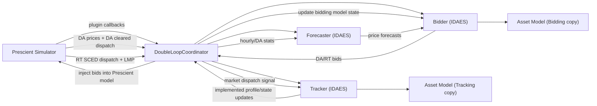
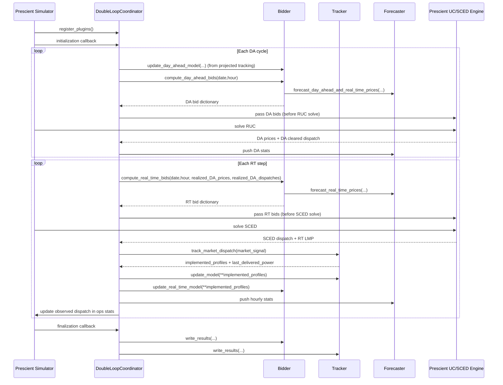

---
{"dg-publish":true,"permalink":"/30-projects/double-simulation-loop/prescient/"}
---


#rt_sced #da_uc 


# RT SCED and Tracker alignment 
RT SCED in Prescient is also a look-ahead solve.

Two knobs control it:

- `sced_horizon` = number of SCED time periods in each RT optimization.
- `sced_frequency_minutes` = length/frequency of each RT period.

From your setup:
- `sced_horizon = 4` in thermal/idc examples ([thermal:784](/Users/vardhans/Projects/idaes-pse/idaes/apps/grid_integration/examples/thermal_generator.py:784), [idc_run:74](/Users/vardhans/Projects/idaes-pse/idaes/apps/grid_integration/examples/idc_run.py:74))
- `sced_frequency_minutes = 60` (explicit in `idc_run.py`, and default is 60 in Prescient config: [config.py:261](/Users/vardhans/Library/Python/3.11/lib/python/site-packages/prescient/simulator/config.py:261))

So in your current runs, each RT SCED solve looks ahead 4 hourly periods (about 4 hours), not just next 15 minutes.

If you want 15-minute RT, set `sced_frequency_minutes=15`. Then:
- `sced_horizon=1` means 15-min look-ahead,
- `sced_horizon=4` means 1-hour look-ahead.


With `sced_horizon = 4` and tracker horizon set to 4, coordinator takes SCED dispatch plus DA continuation to build a 4-step market signal, then tracker solves a 4-step optimization on that signal.

Small nuance:
- tracker usually implements only the first step (`n_tracking_hour = 1`),
- then repeats next RT step with updated SCED data (receding horizon).


This is a **very central concept in power markets**, and once you understand it, the whole Prescient simulation becomes much clearer. I’ll explain it simply and then summarize what Prescient is doing.

---

# Two Markets in Prescient

Prescient simulates **two sequential markets** that real power systems operate:

1. **Day-Ahead Market (Unit Commitment – UC / RUC)**
    
2. **Real-Time Market (Security Constrained Economic Dispatch – SCED)**
    

Think of it like **planning vs execution**.

```
Day Ahead Market → planning the next day
Real Time Market → adjusting every few minutes
```

---

## 1️⃣ Day-Ahead Market (UC / RUC)

### Purpose

Decide **which generators should be turned ON tomorrow and roughly how much they will produce each hour.**

This is necessary because many generators:

- take hours to start
    
- have minimum run times
    
- cannot ramp quickly
    

So the system operator must **commit units in advance**.

---

## What happens in the Day-Ahead UC market

The market operator solves a large optimization problem:

[  
\min \text{Total Generation Cost}  
]

subject to

- power balance
    
- transmission constraints
    
- generator limits
    
- ramp constraints
    
- startup/shutdown constraints
    
- reserve requirements
    

The decision variables include:

|Variable|Meaning|
|---|---|
|commitment|whether a generator is ON or OFF|
|dispatch|planned power output|
|reserves|spinning / regulation reserves|

---

### Output of Day-Ahead Market

For every hour tomorrow:

|Output|Meaning|
|---|---|
|unit commitment|which generators are ON|
|scheduled generation|planned output|
|day-ahead price|DA LMP at each bus|

Example:

|Generator|Hour|DA Dispatch|
|---|---|---|
|Gen1|10|80 MW|
|Gen2|10|50 MW|

But remember:

**This is only a plan.**

Real conditions tomorrow will change.

---

## 2️⃣ Real-Time Market (SCED)

### Purpose

Adjust generation in **real time** as actual conditions change.

Things that change in reality:

- load forecast errors
    
- wind/solar forecast errors
    
- outages
    
- network congestion
    

Real-time market runs much more frequently (5–15 minutes).

---

## What happens in Real-Time SCED

The operator solves a **simpler optimization**:

[  
\min \text{Generation Cost}  
]

subject to

- power balance
    
- transmission limits
    
- ramp limits
    
- generator output bounds
    

But **commitment decisions are fixed** from the day-ahead market.

SCED only decides:

|Variable|Meaning|
|---|---|
|dispatch|exact generation level|

---

### Output of Real-Time Market

Every 5–15 minutes:

|Output|Meaning|
|---|---|
|real-time dispatch|actual generation|
|real-time price|RT LMP|

Example:

|Generator|Time|RT Dispatch|
|---|---|---|
|Gen1|10:05|83 MW|
|Gen2|10:05|47 MW|

These differ from day-ahead schedule.

---

## What Prescient Actually Simulates

Prescient repeatedly simulates this full process.

```
1. Day Ahead UC
2. Real Time SCED
3. Update system state
4. Repeat
```

Timeline example:

```
Day Ahead Market (for next 24 hours)

Then every 5 minutes:

Real Time SCED
Real Time SCED
Real Time SCED
...
```

---

## Where IDAES fits in this process

IDAES inserts your asset (IDC, generator, etc.) into both markets.

```
Bidder → submits bids to DA and RT markets
Prescient → clears UC and SCED
Tracker → ensures dispatch is feasible
```

So the full loop becomes:

```
Bidder → Prescient DA UC → DA schedule

Bidder → Prescient RT SCED → dispatch

Tracker → implement dispatch physically
```

---

## Simple Mental Model

|Market|Question it answers|
|---|---|
|Day-Ahead UC|Which generators should be ON tomorrow?|
|Real-Time SCED|Given what’s ON, how much should each produce right now?|

---

## Why this matters for your IDC work

Your IDC will participate in both markets:

### Day Ahead

IDC decides:

```
When should I consume compute power tomorrow?
```

### Real Time

IDC adjusts:

```
How much power should I consume now
given real-time prices and backlog?
```

---

If you'd like, I can also show you **the exact mathematical difference between UC and SCED optimization problems**, which makes their roles extremely clear (and also explains why UC is MILP but SCED is usually LP).





